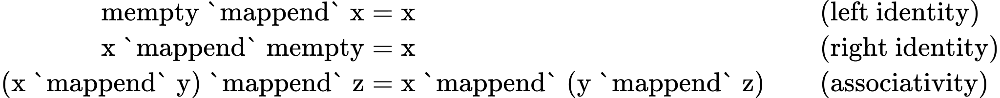

# Failure and Choice (`Alternative`, `MonadPlus`, `ArrowZero`, `ArrowPlus`)

``` haskell
{-# LANGUAGE InstanceSigs #-}
{-# LANGUAGE TypeOperators #-}

import Control.Arrow (Arrow(..))

-- Needed for compilation
main :: IO ()
main = return ()
```

-   Some typeclasses have “monoidal” subclasses to model computations
    that support failure and choice
    -   `Applicative` -> `Alternative`
    -   `Monad` -> `MonadPlus`
    -   `Arrow` -> `ArrowZero` + `ArrowPlus`
-   `MonadZero` used to exist, representing monads with failure to deal
    with failing pattern matches
    -   Scrapped in favour of adding `fail` method to `Monad`, but
        hopefully that will be reverted!
    -   Idea: any `do`-block that uses pattern matching and so may fail
        needs a constraint of `MonadZero`, otherwise `Monad` is fine

## Definition

-   For `Applicative`, we have:

``` haskell
class Applicative f => Alternative f where
  empty :: f a
  (<|>) :: f a -> f a -> f a

  some :: f a -> f [a]
  some v = (:) <$> v <*> many v
  many :: f a -> f [a]
  many v = some v <|> pure []
```

-   `empty` represents some sort of “failure” state—identity element
-   `(<|>)` represents a choice between alternatives—associative binary
    operation
-   These descriptions do not fully capture the nuance of what is
    possible with this typeclass
-   `some` and `many` have default definitions:

``` haskell
{-
some v = (:) <$> v <*> many v
many v = some v <|> pure []
-}
```

-   Not actually implemented using mutual recursion!

-   Both keep “running” `v` and collecting results into a list until
    failure

-   `some` requires `v` to succeed at least once (1 or more repetitions
    of `v`)

-   `many` does not require `v` to succeed at all (0 or more repetitions
    of `v`)

-   For `Monad`, we have:

``` haskell
class Monad m => MonadPlus m where
  mzero :: m a
  mplus :: m a -> m a -> m a
```

-   For `Arrow`, we have:

``` haskell
class Arrow arr => ArrowZero arr where
  zeroArrow :: b `arr` c

class ArrowZero arr => ArrowPlus arr where
  (<+>) :: (b `arr` c) -> (b `arr` c) -> (b `arr` c)
```

## Instances

-   Will mainly focus on `Alternative`; now that `Applicative` is a
    superclass of `Monad`, there is not much reason to use `MonadPlus`
    anymore, and `ArrowPlus` is obscure

-   Discussing instances before laws, because it will be helpful to have
    concrete examples when looking over some of the controversial laws

-   `Maybe` instance for `Alternative` is exact same as `First` (returns
    first non-`Nothing` value)

``` haskell
instance Alternative Maybe where
  empty :: Maybe a
  empty = Nothing

  (<|>) :: Maybe a -> Maybe a -> Maybe a
  Nothing <|> b = b
  a <|> _       = a
```

-   `[]` instance for `Alternative` is exact same as for `Monoid`

``` haskell
instance Alternative [] where
  empty :: [a]
  empty = []

  (<|>) :: [a] -> [a] -> [a]
  (<|>) = (++)
```

-   Behaviour of `some` and `many` for these two:
    -   `Maybe`:
        -   `some Nothing == (:) <$> Nothing <*> many Nothing == Nothing <*> many Nothing == Nothing`
        -   Thus, also have
            `many Nothing == some Nothing <|> pure [] == Nothing <|> pure [] == pure [] == Just []`
        -   When applying `some` or `many` to `Just x`, they never
            terminate. Since `Just x` is always “successful”, the
            recursion never terminates
            -   In theory, this should give infinite list
                `Just [x,x,x,...]`, but cannot even start producing this
                list because it needs to know if the result of
                `many (Just x)` is also `Just`, which it never gets
    -   Similar for `[]`:
        -   `some [] == (:) <$> [] <*> many [] == [] <*> many [] == []`
        -   `many [] == some [] <|> pure [] == [] <|> pure [] == pure [] == [[]]`
        -   `some` and `many` return `bottom` (`⊥`) for non-empty lists
-   As can be seen, `some` and `many` only really make sense for
    “stateful” `Applicative` instances, that can succeed a finite number
    of times and then fail (like a parser)
    -   Parsers were the motivation for `some` and `many`
-   `IO` has an instance where
    -   `empty` throws an IO exception
    -   `(<|>)` runs its first argument; if that throws an IO exception
        (and only an IO exception), it is caught and then the second
        argument is run
    -   There are better ways to handle errors, but it can be useful for
        quick-and-dirty things like
        `readFile "file.txt" <|> return "default file contents"`, if
        `file.txt` doesn’t exist
-   For `Concurrently`,
    -   `(<|>)` races both its argument computations in parallel, and
        returns the result of the first one to finish
    -   `empty` is an action that runs forever without returning a value
-   Almost any parser type has an instance, where
    -   `empty` is an unconditional parse failure
    -   `(<|>)` is left-biased choice (try parsing with first argument,
        then try parsing with second one if that fails)
    -   `some` and `many` work well with parsers
        -   `some p` parses one or more consecutive instances of `p`,
            and `many p` parses 0 or more

## Laws

-   Since `Alternative` is a monoidal extension of `Applicative`, it
    should satisfy the monoid laws, i.e.

<!-- $$
\begin{aligned}
\text{mempty `mappend` x} &= \text{x} && \text{(left identity)}\\
\text{x `mappend` mempty} &= \text{x} && \text{(right identity)}\\
\text{(x `mappend` y) `mappend` z} &= \text{x `mappend` (y `mappend` z)} && \text{(associativity)}
\end{aligned}
$$ -->

<div align="center">



</div>

-   It is documented that `some` and `many` should be the “least
    solution” to their mutually recursive definitions, but there is
    controversy over this as it has not been well thought-out

-   Since `Alternative` is a subclass of `Applicative`, we should ask
    how `empty` and `(<|>)` interact with `pure` and `(<*>)`

    -   `empty <*> f = empty` (left zero). Almost everyone agrees on
        this law
    -   The other laws see more disagreement:
        -   `f <*> empty = empty` (right zero)
            -   Satisfied by most instances. Notable exception: `IO`
            -   Once the effects in `f` have been executed, later
                encountering an exception won’t roll them back
            -   If `f` is `Applicative`, `Backwards f` is too (works the
                same but performs arguments to `(<*>)` in reverse
                order). Same for `Alternative`
            -   If some `f` satisfies (left zero) but not (right zero),
                `Backwards f` does the opposite. So we cannot privilege
                one direction as being more correct than the other
        -   `(a <|> b) <*> c = (a <*> c) <|> (b <*> c)` (left
            distribution)
            -   Satisfied by `[]` and `Maybe`
            -   Not satisfied by most parsers, because `a` and `b` might
                have effects that influence the result of `c`, causing
                the LHS to fail but the RHS to succeed
                -   Ex.: `a` deletes a file and `c` tries to read it,
                    whereas `b` ensures the file exists. Then `a <|> b`
                    successfully executes `a` and ignores `b`, causing
                    `c` to throw when executed. Since `a <*> b` will
                    similarly fail, we compute `b <*> c`, which succeeds
                -   Ex.: in parsers, `(a <|> b) <*> c` has to commit to
                    parsing with either `a` or `b` before parsing with
                    `c`, but `(a <*> c) <|> (b <*> c)` allows
                    backtracking if `a <*> c` fails, i.e. think if `a`
                    and `c` both match `*` twice, `b` matches `*` once,
                    and the input is `***`
        -   `a <*> (b <|> c) = (a <*> b) <|> (a <*> c)` (right
            distribution)
            -   Not satisfied by many types (satisfied by `Maybe`, but
                not `[]`)
            -   In case of `[]`, results are in different order. For
                example, for `a = [(+1), (*10)]`, `b = [2]` and
                `c = [3]`, the LHS gives `[3,4,20,30]` but the RHS
                returns `[3,20,4,30]`
            -   In case of `IO`, `a` may only succeed the second time it
                is executed
            -   In case of parsers, may satisfy this law *if* `<|>` does
                full backtracking for the parser (not often the case).
                -   Otherwise, if `a <*> b` fails, then `a <*> c` will
                    be attempted without backtracking to before the text
                    that a matched; this could result in a failure. The
                    LHS doesn’t suffer from this
        -   `(pure a) <|> x = pure a` (left catch)
            -   States `pure a` should always be a successful
                computation
            -   Satisfies `Maybe`, `IO` and parsers
            -   Does not satisfy `[]`, because lists collect all
                possible computation results (i.e. it would mean
                `[a] ++ x == [a]`)

-   There are a lot of instances of `Alternative` and `MonadPlus` that
    satisfy only a subset of these laws

    -   Not always same subset. No obvious “default” set of laws
    -   Just have to live with it! Must be careful to think about which
        laws are satisfied by the instance you’re using

## Utility Functions

-   `guard` evaluates to `pure ()` if the given condition is `True`, and
    `empty` otherwise. Can be used to create conditional failure point
    in middle of computation (computation only proceeds if condition
    holds)
-   `optional` takes a computation and makes it one that always
    succeeds, by returning `Just x` if the underlying computation worked
    (where `x` is its return value), and `Nothing` if it failed
    -   Useful in parsers where it corresponds to a production which can
        occur 0 or more times
